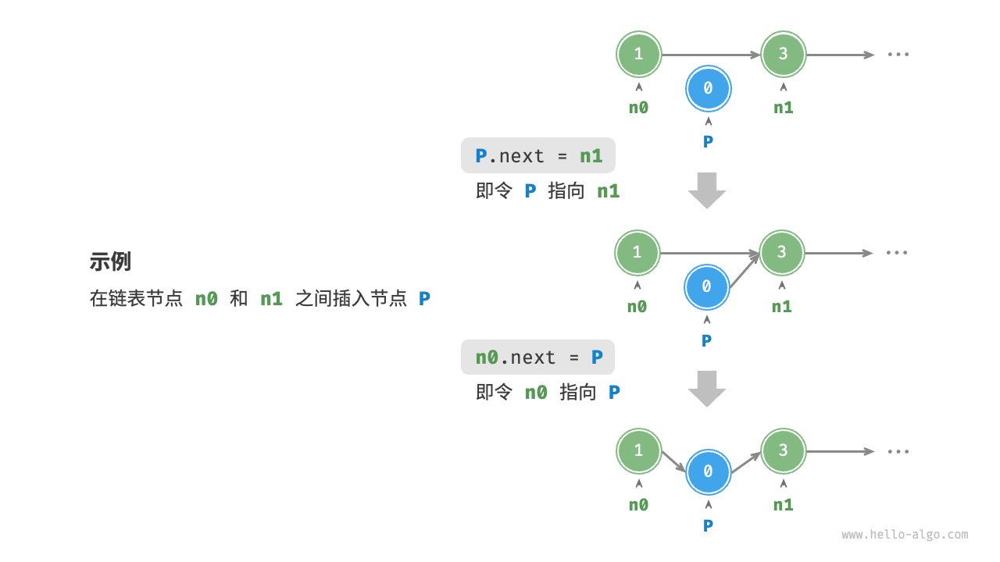
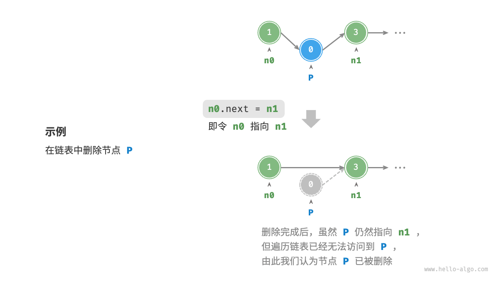

# 数组
    数组（array）是一种线性数据结构，其将相同类型的元素存储在连续的内存空间中。我们将元素在数组中的位置称为该元素的索引（index）。

## 数组常用操作

### 初始化数组
    初始化方式：无初始值、给定初始值。大多数编程语言会将数组元素初始化为0.

### 访问元素
    数组元素被存储在连续的内存空间中，给定数组内存地址（首元素内存地址）和某个元素的索引,从而直接访问该元素.

### 插入元素
    如果想在数组中间插入一个元素，则需要将该元素之后的所有元素都向后移动一位，之后再把元素赋值给该索引。

### 删除元素
    若想删除索引处的元素，则需要把索引 之后的元素都向前移动一位。

# 链表
    链表（linked list）是一种线性数据结构，其中的每个元素都是一个节点对象，各个节点通过“引用”相连接。引用记录了下一个节点的内存地址，通过它可以从当前节点访问到下一个节点。链表的设计使得各个节点可以分散存储在内存各处，它们的内存地址无须连续。

    _链表的首个节点被称为“头节点”，最后一个节点被称为“尾节点”_
    _尾节点指向的是“空”，它在 Java、C++ 和 Python 中分别被记为 null、nullptr 和 None_

## 链表常用操作

    -new的用法:  
        +new()分配这种类型的一个大小的内存空间,并以括号中的值来初始化这个变量;  
        `new listNode(1);`  
        +new[]分配这种类型的n个大小的内存空间,并用默认构造函数来初始化这些变量;  
        `char* p=new char[6]; strcpy(p,"Hello");`  
        +当使用new运算符定义一个多维数组变量或数组对象时,它产生一个指向数组第一个元素的指针，返回的类型保持了除最左边维数外的所有维数。  
        `int *p1 = new int[10];`  
        返回的是一个指向int的指针int*  
        `int (*p2)[10] = new int[2][10];`
        +new创建对象  
        new创建对象需要指针接收，一处初始化，多处使用;  
        new创建对象使用完需delete销毁;  
        new创建对象直接使用堆空间，而局部不用new定义对象则使用栈空间;  
        new对象指针用途广泛，比如作为函数返回值、函数参数等;  
        频繁调用场合并不适合new，就像new申请和释放内存一样。  
        
### 初始化链表
    建立链表分为两步，第一步是初始化各个节点对象，第二步是构建节点之间的引用关系。初始化完成后，我们就可以从链表的头节点出发，通过引用指向 next 依次访问所有节点。

### 插入节点
    只需改变两个节点引用（指针）即可。  
      

### 删除节点
    只需改变一个节点的引用（指针）即可。  
      

### 查找节点
遍历链表，查找其中值为 target 的节点，输出该节点在链表中的索引。此过程也属于线性查找。

## 常见链表类型
单向链表：即前面介绍的普通链表。单向链表的节点包含值和指向下一节点的引用两项数据。我们将首个节点称为头节点，将最后一个节点称为尾节点，尾节点指向空 None 。

环形链表：如果我们令单向链表的尾节点指向头节点（首尾相接），则得到一个环形链表。在环形链表中，任意节点都可以视作头节点。

双向链表：与单向链表相比，双向链表记录了两个方向的引用。双向链表的节点定义同时包含指向后继节点（下一个节点）和前驱节点（上一个节点）的引用（指针）。相较于单向链表，双向链表更具灵活性，可以朝两个方向遍历链表，但相应地也需要占用更多的内存空间。

### 链表典型应用

#### 单向链表通常用于实现栈、队列、哈希表和图等数据结构。

栈与队列：当插入和删除操作都在链表的一端进行时，它表现的特性为先进后出，对应栈；当插入操作在链表的一端进行，删除操作在链表的另一端进行，它表现的特性为先进先出，对应队列。

哈希表：链式地址是解决哈希冲突的主流方案之一，在该方案中，所有冲突的元素都会被放到一个链表中。

图：邻接表是表示图的一种常用方式，其中图的每个顶点都与一个链表相关联，链表中的每个元素都代表与该顶点相连的其他顶点。

#### 双向链表常用于需要快速查找前一个和后一个元素的场景。
高级数据结构：比如在红黑树、B 树中，我们需要访问节点的父节点，这可以通过在节点中保存一个指向父节点的引用来实现，类似于双向链表。

浏览器历史：在网页浏览器中，当用户点击前进或后退按钮时，浏览器需要知道用户访问过的前一个和后一个网页。双向链表的特性使得这种操作变得简单。

LRU 算法：在缓存淘汰（LRU）算法中，我们需要快速找到最近最少使用的数据，以及支持快速添加和删除节点。这时候使用双向链表就非常合适。

#### 环形链表常用于需要周期性操作的场景，比如操作系统的资源调度。
时间片轮转调度算法：在操作系统中，时间片轮转调度算法是一种常见的 CPU 调度算法，它需要对一组进程进行循环。每个进程被赋予一个时间片，当时间片用完时，CPU 将切换到下一个进程。这种循环操作可以通过环形链表来实现。

数据缓冲区：在某些数据缓冲区的实现中，也可能会使用环形链表。比如在音频、视频播放器中，数据流可能会被分成多个缓冲块并放入一个环形链表，以便实现无缝播放。

# 数组 vs 链表
  |      |  数组  |  链表  |
  |:--------|:--------|:--------:|
  |  存储方式 | 连续内存空间 | 分散内存空间 |
  |  容量扩展 | 长度不可变 | 可灵活扩展 |
  |  内存效率 | 元素占用内存少、但可能浪费空间 | 元素占用内存多 |
  |  访问元素 | O~(1)~ | O~(n)~ |
  |  添加元素 | O~(n)~ | O~(1)~ |
  |  删除元素 | O~(n)~ | O~(1)~ |